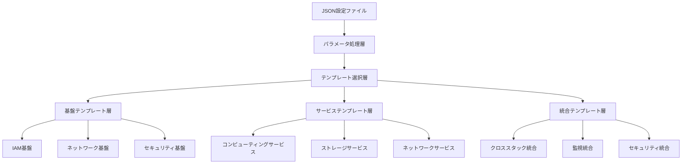

# 設計書

## 概要

Well-Architected Framework準拠のCloudFormationテンプレートシステムは、モジュラー設計アプローチを採用し、各AWSサービスを独立したテンプレートとして実装しながら、サービス間の統合を可能にします。システムは階層化されたアーキテクチャを使用し、基盤テンプレート、サービス固有テンプレート、統合テンプレートの3層構造で構成されます。

## アーキテクチャ

### 全体アーキテクチャ



### ディレクトリ構造

```
cf-templates/
├── foundation/           # 基盤テンプレート
│   ├── iam/
│   ├── organization/
│   ├── config/
│   └── kms/
├── networking/          # ネットワークテンプレート
│   ├── vpc/
│   ├── route53/
│   └── elb/
├── compute/            # コンピューティングテンプレート
│   ├── ec2/
│   └── lambda/
├── integration/        # 統合テンプレート
│   ├── api-gateway/
│   └── cloudwatch/
├── patterns/           # 統合パターン
│   ├── web-application/
│   ├── microservices/
│   └── data-processing/
├── configurations/     # 設定例
│   ├── examples/
│   └── schemas/
└── utilities/          # ユーティリティ
    ├── parameter-processor/
    └── validation/
```

## コンポーネントと インターフェース

### 1. パラメータ処理コンポーネント

**目的**: JSON設定ファイルをCloudFormationパラメータに変換

**インターフェース**:
```json
{
  "inputSchema": "JSON設定スキーマ",
  "outputFormat": "CloudFormationパラメータ",
  "validationRules": "検証ルール",
  "transformationLogic": "変換ロジック"
}
```

**主要機能**:
- JSON設定の検証
- CloudFormationパラメータへの変換
- エラーハンドリングとメッセージ生成
- 設定テンプレートの生成

### 2. テンプレート管理コンポーネント

**目的**: CloudFormationテンプレートの管理と選択

**インターフェース**:
```yaml
TemplateMetadata:
  Name: テンプレート名
  Version: バージョン
  Dependencies: 依存関係リスト
  WellArchitectedCompliance: 準拠項目リスト
  ConfigurationOptions: 設定オプション
```

**主要機能**:
- テンプレートカタログ管理
- 依存関係解決
- バージョン管理
- Well-Architected準拠チェック

### 3. 統合管理コンポーネント

**目的**: サービス間の統合とクロススタック参照の管理

**インターフェース**:
```yaml
IntegrationPoints:
  Exports: エクスポート値リスト
  Imports: インポート値リスト
  Dependencies: 依存スタックリスト
  ValidationRules: 統合検証ルール
```

## データモデル

### 設定データモデル

```json
{
  "projectConfig": {
    "projectName": "string",
    "environment": "dev|staging|prod",
    "region": "string",
    "availabilityZones": ["string"],
    "tags": {
      "key": "value"
    }
  },
  "serviceConfigs": {
    "vpc": {
      "pattern": "basic|advanced|enterprise",
      "cidrBlock": "string",
      "enableDnsHostnames": "boolean",
      "enableDnsSupport": "boolean"
    },
    "ec2": {
      "instanceType": "string",
      "amiId": "string",
      "keyPairName": "string",
      "securityGroups": ["string"]
    }
  },
  "integrationOptions": {
    "crossStackReferences": "boolean",
    "sharedResources": ["string"],
    "monitoringIntegration": "boolean"
  }
}
```

### テンプレートメタデータモデル

```yaml
AWSTemplateFormatVersion: '2010-09-09'
Description: 'Well-Architected準拠テンプレート'

Metadata:
  WellArchitectedCompliance:
    OperationalExcellence: [OPS04-BP01, OPS04-BP02]
    Security: [SEC01-BP01, SEC02-BP02]
    Reliability: [REL01-BP04, REL02-BP01]
    PerformanceEfficiency: [PERF02-BP01, PERF03-BP01]
    CostOptimization: [COST02-BP05, COST05-BP01]
    Sustainability: [SUS02-BP01, SUS04-BP02]
  
  ConfigurationPatterns:
    Basic:
      Description: "基本的な設定"
      Parameters: {}
    Advanced:
      Description: "高度な設定"
      Parameters: {}
    Enterprise:
      Description: "エンタープライズ設定"
      Parameters: {}
```

## エラーハンドリング

### エラー分類

1. **設定エラー**
   - 無効なJSON形式
   - 必須パラメータの不足
   - パラメータ値の範囲外

2. **テンプレートエラー**
   - テンプレートの構文エラー
   - 依存関係の循環参照
   - リソース制限の超過

3. **統合エラー**
   - クロススタック参照の失敗
   - サービス間の互換性問題
   - リージョン制限の違反

### エラーハンドリング戦略

```yaml
ErrorHandling:
  ValidationPhase:
    - JSONスキーマ検証
    - パラメータ範囲チェック
    - 依存関係検証
  
  DeploymentPhase:
    - プリフライトチェック
    - ロールバック戦略
    - 部分デプロイメント対応
  
  MonitoringPhase:
    - デプロイメント状況監視
    - エラーアラート
    - 自動修復機能
```

## テスト戦略

### テストレベル

1. **単体テスト**
   - 各テンプレートの構文検証
   - パラメータ処理ロジックのテスト
   - Well-Architected準拠チェック

2. **統合テスト**
   - クロススタック参照のテスト
   - サービス間連携のテスト
   - エンドツーエンドデプロイメントテスト

3. **コンプライアンステスト**
   - Well-Architected Framework準拠の検証
   - セキュリティ設定の検証
   - コスト最適化の検証

### テスト自動化

```yaml
TestAutomation:
  PreCommitHooks:
    - テンプレート構文チェック
    - Well-Architected準拠チェック
    - セキュリティスキャン
  
  ContinuousIntegration:
    - 自動テストスイート実行
    - 複数環境でのデプロイメントテスト
    - パフォーマンステスト
  
  ContinuousDeployment:
    - 段階的デプロイメント
    - カナリアデプロイメント
    - 自動ロールバック
```

### Well-Architected準拠実装

#### オペレーショナルエクセレンス

- **監視とログ記録**: すべてのリソースにCloudWatchログとメトリクスを設定
- **自動化**: Infrastructure as Codeによる完全自動化
- **変更管理**: GitOpsワークフローによる変更追跡

#### セキュリティ

- **暗号化**: KMSによる保存時暗号化と転送時暗号化
- **アクセス制御**: IAMロールとポリシーによる最小権限アクセス
- **ネットワークセキュリティ**: VPCとセキュリティグループによる多層防御

#### 信頼性

- **マルチAZ配置**: 高可用性のための複数AZ展開
- **自動バックアップ**: 定期的なバックアップとリストア機能
- **ヘルスチェック**: 自動障害検知と復旧

#### パフォーマンス効率

- **リソース最適化**: ワークロードに最適なインスタンスタイプの選択
- **オートスケーリング**: 需要に応じた自動スケーリング
- **キャッシング**: CloudFrontとElastiCacheによる性能向上

#### コスト最適化

- **リザーブドインスタンス**: 長期利用でのコスト削減
- **スポットインスタンス**: 適用可能なワークロードでの活用
- **ライフサイクル管理**: S3ライフサイクルポリシーによるストレージコスト最適化

#### 持続可能性

- **リソース効率**: 必要最小限のリソース使用
- **リージョン選択**: 再生可能エネルギー使用率の高いリージョン優先
- **自動シャットダウン**: 非本番環境での自動停止機能