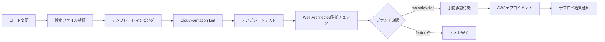

# ブランチ戦略とCI/CDパイプライン

## ブランチ戦略

このプロジェクトでは **Git Flow** をベースとしたブランチ戦略を採用しています。

### ブランチ構成

```
main (本番環境)
├── develop (開発統合環境)
├── feature/* (機能開発)
├── hotfix/* (緊急修正)
└── release/* (リリース準備)
```

### ブランチ命名規則

#### 1. メインブランチ

- **`main`**: 本番環境用のブランチ
  - 常に安定した状態を保つ
  - 直接コミットは禁止
  - `develop` または `hotfix/*` からのマージのみ

- **`develop`**: 開発統合用のブランチ
  - 機能開発の統合ポイント
  - ステージング環境へのデプロイ対象
  - `feature/*` ブランチからのマージを受け入れ

#### 2. 作業ブランチ

- **`feature/<機能名>`**: 新機能開発用
  - 例: `feature/vpc-template-enhancement`
  - 例: `feature/lambda-monitoring-integration`
  - `develop` ブランチから分岐
  - 完了後は `develop` にマージ

- **`hotfix/<修正内容>`**: 緊急修正用
  - 例: `hotfix/security-group-rule-fix`
  - 例: `hotfix/iam-policy-vulnerability`
  - `main` ブランチから分岐
  - 完了後は `main` と `develop` の両方にマージ

- **`release/<バージョン>`**: リリース準備用
  - 例: `release/v1.2.0`
  - 例: `release/2024.03`
  - `develop` ブランチから分岐
  - 完了後は `main` と `develop` にマージ

#### 3. 特殊ブランチ

- **`docs/<ドキュメント名>`**: ドキュメント更新用
  - 例: `docs/api-documentation-update`
  - 例: `docs/deployment-guide-revision`

- **`test/<テスト内容>`**: テスト改善用
  - 例: `test/integration-test-enhancement`
  - 例: `test/performance-test-addition`

## CI/CDパイプライン動作

### トリガー条件

| ブランチ | プッシュ時の動作 | プルリクエスト時の動作 |
|---------|----------------|---------------------|
| `main` | 本番デプロイメント（手動承認必須） | 統合テスト実行 |
| `develop` | ステージング環境デプロイ（手動承認必須） | 統合テスト実行 |
| `feature/*` | テスト実行のみ | テスト実行のみ |
| `hotfix/*` | テスト実行 + 緊急デプロイ準備 | 統合テスト実行 |

### パイプライン段階



## 環境とデプロイメント

### 環境マッピング

| ブランチ | 環境 | AWSアカウント | 承認要件 |
|---------|------|-------------|---------|
| `main` | 本番環境 | Production Account | 必須（手動承認） |
| `develop` | ステージング環境 | Staging Account | 必須（手動承認） |
| `feature/*` | 開発環境 | Development Account | テストのみ |
| `hotfix/*` | 本番環境 | Production Account | 必須（緊急承認） |

### デプロイメント戦略

#### 1. 通常デプロイメント（main/develop）
1. 自動テスト実行
2. Well-Architected準拠チェック
3. 手動承認待機
4. CloudFormationスタックデプロイ
5. デプロイ結果確認

#### 2. 機能開発（feature/*）
1. 自動テスト実行
2. テンプレート検証
3. ドライラン実行
4. 結果レポート生成

#### 3. 緊急修正（hotfix/*）
1. 自動テスト実行（短縮版）
2. 緊急承認プロセス
3. 即座にデプロイメント
4. 事後確認とロールバック準備

## ワークフロー例

### 新機能開発の流れ

```bash
# 1. 開発ブランチから機能ブランチを作成
git checkout develop
git pull origin develop
git checkout -b feature/new-lambda-template

# 2. 機能開発とテスト
# - CloudFormationテンプレート作成
# - JSON設定ファイル作成
# - ローカルテスト実行

# 3. コミットとプッシュ
git add .
git commit -m "feat: add new Lambda template with monitoring"
git push origin feature/new-lambda-template

# 4. プルリクエスト作成
# - GitHub上でPRを作成
# - 自動テストの実行を確認
# - コードレビューを受ける

# 5. developブランチにマージ
# - PR承認後、developにマージ
# - ステージング環境への自動デプロイ
```

### 緊急修正の流れ

```bash
# 1. mainブランチから緊急修正ブランチを作成
git checkout main
git pull origin main
git checkout -b hotfix/security-vulnerability-fix

# 2. 修正作業
# - 問題のあるテンプレートを修正
# - セキュリティ設定を更新

# 3. テストとコミット
git add .
git commit -m "fix: resolve security vulnerability in IAM template"
git push origin hotfix/security-vulnerability-fix

# 4. 緊急デプロイ
# - PRを作成し、緊急承認を得る
# - 本番環境への即座デプロイ
# - developブランチにもマージ
```

## ベストプラクティス

### 1. コミットメッセージ規約

```
<type>(<scope>): <description>

[optional body]

[optional footer]
```

**Type:**
- `feat`: 新機能
- `fix`: バグ修正
- `docs`: ドキュメント更新
- `style`: コードスタイル変更
- `refactor`: リファクタリング
- `test`: テスト追加・修正
- `chore`: その他の変更

**例:**
```
feat(vpc): add enterprise pattern with advanced security

- Add support for multiple NAT gateways
- Implement VPC Flow Logs
- Add Network ACL configurations

Closes #123
```

### 2. プルリクエストガイドライン

#### 必須チェック項目
- [ ] CloudFormationテンプレートの構文チェック
- [ ] JSON設定ファイルの妥当性確認
- [ ] Well-Architected準拠チェック
- [ ] セキュリティ設定の確認
- [ ] ドキュメントの更新

#### PRテンプレート
```markdown
## 変更内容
- 

## テスト内容
- [ ] ローカルでのテンプレート検証
- [ ] CI/CDパイプラインの成功確認
- [ ] Well-Architected準拠チェック

## 影響範囲
- 

## 確認事項
- [ ] 既存のスタックに影響がないか確認
- [ ] セキュリティ設定が適切か確認
- [ ] コスト影響を評価済み
```

### 3. ブランチ保護ルール

#### mainブランチ
- 直接プッシュ禁止
- プルリクエスト必須
- レビュー承認必須（最低2名）
- ステータスチェック必須
- 管理者も含めて制限適用

#### developブランチ
- 直接プッシュ禁止
- プルリクエスト必須
- レビュー承認必須（最低1名）
- ステータスチェック必須

## トラブルシューティング

### よくある問題と解決方法

#### 1. CI/CDパイプラインの失敗

**問題**: テンプレート検証エラー
```
Template validation failed: Parameter 'VpcId' is required
```

**解決方法**:
1. JSON設定ファイルに必須パラメータが含まれているか確認
2. パラメータ名のスペルミスがないか確認
3. テンプレートの必須パラメータ定義を確認

#### 2. AWSアカウント指定の問題

**問題**: デプロイ先アカウントが不明
```
WARNING: No AWS account specified in configuration files
```

**解決方法**:
JSON設定ファイルに以下のいずれかを追加:
```json
{
  "Parameters": {
    "AWSAccount": "123456789012"
  }
}
```

#### 3. 権限エラー

**問題**: CloudFormationデプロイ時の権限不足
```
User is not authorized to perform: cloudformation:CreateStack
```

**解決方法**:
1. GitHub Secretsの認証情報を確認
2. IAMロールの権限を確認
3. AssumeRoleの設定を確認

### サポートとエスカレーション

- **一般的な質問**: GitHub Discussions
- **バグレポート**: GitHub Issues
- **緊急事態**: DevOpsチームに直接連絡
- **セキュリティ問題**: セキュリティチームに直接報告