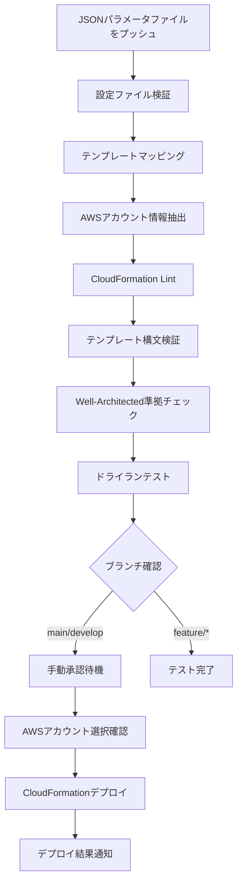

# CI/CDパイプライン実装概要

## 概要

このドキュメントでは、CloudFormationテンプレート用のGitHub Actions CI/CDパイプラインの実装について説明します。

**重要**: このプロジェクトでは、マルチアカウント方式と単一アカウント方式の2つのワークフローを提供しています。適切なワークフローの選択については、[ワークフロー選択ガイド](workflow-selection-guide.md)を参照してください。

パイプラインは、JSONパラメータファイルの変更を検出し、対応するCloudFormationテンプレートのテストとデプロイメントを自動化します。

## パイプラインの処理フロー



## 実装されたステージ

### ステージ1: 設定ファイルの検証とテンプレートマッピング

**目的**: 変更されたJSONパラメータファイルを検出し、対応するCloudFormationテンプレートにマッピングする

**処理内容**:
1. **変更ファイル検出**: `git diff`を使用して変更された`*-config-*.json`ファイルを特定
2. **JSON検証**: JSONスキーマを使用して設定ファイルの妥当性を確認
3. **AWSアカウント抽出**: 設定ファイルから以下のキーでAWSアカウント情報を検索
   - `Parameters.AWSAccount`
   - `Parameters.TargetAccount`
   - `Parameters.AccountId`
   - `AWSAccount` (ルートレベル)
4. **テンプレートマッピング**: 設定ファイルのパスから対応するテンプレートファイルを推定

**出力**:
- `config-files`: 変更された設定ファイルのリスト
- `templates-to-test`: テストするテンプレートと設定のペア
- `aws-account`: 検出されたAWSアカウントID
- `deployment-region`: デプロイ先リージョン

### ステージ2: CloudFormationテンプレートのテスト

**目的**: 各テンプレートの品質と妥当性を確認する

**処理内容**:
1. **CFN Lint**: `cfn-lint`を使用したテンプレートの構文チェック
2. **AWS CLI検証**: `aws cloudformation validate-template`による構文検証
3. **パラメータ変換**: JSON設定をCloudFormationパラメータ形式に変換
4. **ドライランテスト**: Change Setを使用した実際のデプロイメントテスト
5. **Well-Architected準拠チェック**: テンプレートメタデータの準拠項目確認

**マトリックス実行**: 複数のテンプレートを並列でテスト

### ステージ3: 手動デプロイメント承認

**目的**: 本番環境への安全なデプロイメントを確保する

**処理内容**:
1. **環境判定**: AWSアカウントIDに基づく環境の自動判定
2. **承認要求**: GitHub Environmentsを使用した手動承認プロセス
3. **アカウント確認**: 設定ファイルでのAWSアカウント指定状況の確認
4. **デプロイ情報表示**: デプロイ対象の詳細情報表示

**環境マッピング**:
- AWSアカウントが指定されている場合: `aws-account-{ACCOUNT_ID}`環境
- 指定されていない場合: `manual-approval`環境

### ステージ4: 実際のデプロイメント

**目的**: 承認されたテンプレートをAWSにデプロイする

**処理内容**:
1. **AWS認証**: IAMロールを使用したセキュアな認証
2. **スタック操作**: 既存スタックの更新または新規作成
3. **デプロイ監視**: CloudFormationスタック操作の完了待機
4. **結果表示**: スタックの出力値とステータス表示

**スタック命名規則**: `{サービス名}-{ブランチ名}-{コミットハッシュ}`

## デプロイメント先決定ロジック

### 環境ベースのデプロイメント（推奨）

パイプラインは設定ファイルの`Environment`パラメータに基づいてデプロイ先を決定します：

```json
{
  "Parameters": {
    "Environment": "staging",
    "ProjectName": "MyApp",
    "InstanceType": "t3.medium"
  }
}
```

### 環境マッピング

| 設定値 | 正規化された環境 | GitHub Environment | AWS Secrets |
|-------|---------------|------------------|-------------|
| `production`, `prod` | `prod` | `prod-environment` | `AWS_*_PROD` |
| `staging`, `stage` | `staging` | `staging-environment` | `AWS_*_STAGING` |
| `development`, `dev`, `test` | `dev` | `dev-environment` | `AWS_*_DEV` |

### 認証情報の選択

環境に基づいて、対応するGitHub Secretsから認証情報を自動選択します：

```
AWS_ACCESS_KEY_ID_{ENVIRONMENT}
AWS_SECRET_ACCESS_KEY_{ENVIRONMENT}  
AWS_DEPLOYMENT_ROLE_ARN_{ENVIRONMENT}
```

### オプション: 明示的なAWSアカウント指定

特定のAWSアカウントを指定したい場合は、以下のパラメータを追加できます：

```json
{
  "Parameters": {
    "Environment": "production",
    "AWSAccount": "123456789012",
    "ProjectName": "MyApp"
  }
}
```

### 設定例

#### アカウント指定あり（本番環境）
```json
{
  "Parameters": {
    "AWSAccount": "123456789012",
    "Region": "us-east-1",
    "ProjectName": "MyApp",
    "Environment": "production"
  }
}
```

**使用される認証情報:**
- `AWS_ACCESS_KEY_ID_123456789012`
- `AWS_SECRET_ACCESS_KEY_123456789012`
- `AWS_DEPLOYMENT_ROLE_ARN_123456789012`

#### アカウント指定あり（ステージング環境）
```json
{
  "Parameters": {
    "AWSAccount": "987654321098",
    "Region": "us-west-2",
    "ProjectName": "MyApp",
    "Environment": "staging"
  }
}
```

**使用される認証情報:**
- `AWS_ACCESS_KEY_ID_987654321098`
- `AWS_SECRET_ACCESS_KEY_987654321098`
- `AWS_DEPLOYMENT_ROLE_ARN_987654321098`

#### アカウント指定なし
```json
{
  "Parameters": {
    "ProjectName": "MyApp",
    "Environment": "dev"
  }
}
```

**使用される認証情報:**
- `AWS_ACCESS_KEY_ID` (デフォルト)
- `AWS_SECRET_ACCESS_KEY` (デフォルト)
- `AWS_DEPLOYMENT_ROLE_ARN` (デフォルト)

### 動作の違い

| アカウント指定 | 環境名 | 承認プロセス | 使用認証情報 | デプロイ先 |
|-------------|-------|------------|------------|----------|
| あり | `aws-account-123456789012` | 指定アカウント用の承認ルール | アカウント固有のSecrets | 指定されたアカウント |
| なし | `manual-approval` | 汎用承認ルール | デフォルトSecrets | デフォルト設定のアカウント |

### 認証情報の検証プロセス

1. **アカウント検出**: JSONパラメータファイルからAWSアカウントIDを抽出
2. **認証情報選択**: アカウントIDに基づいて対応するGitHub Secretsを選択
3. **存在確認**: 必要な認証情報がすべて設定されているかチェック
4. **認証テスト**: boto3を使用してAWS STSで認証情報の有効性を確認
5. **AssumeRole実行**: 指定されたロールがある場合、一時認証情報を取得
6. **環境変数設定**: 後続のステップで使用するため環境変数に設定

## セキュリティ機能

### 1. ブランチベースの制御

- **main**: 本番環境デプロイ（厳格な承認）
- **develop**: ステージング環境デプロイ（標準承認）
- **feature/***: テストのみ（デプロイなし）
- **hotfix/***: 緊急デプロイ（迅速承認）

### 2. 環境分離

- 各AWSアカウントに対応する個別の環境設定
- アカウント固有の承認者とルール
- 環境固有のSecrets管理

### 3. 権限管理

- IAMロールベースの認証
- 最小権限の原則
- AssumeRoleによる一時的な権限昇格

## 監視とログ

### 1. パイプライン監視

- 各ステージの実行状況をGitHub Actionsで追跡
- 失敗時の詳細ログ出力
- 実行時間とリソース使用量の監視

### 2. デプロイメント監視

- CloudFormationスタックの状態監視
- デプロイ完了/失敗の通知
- ロールバック機能の提供

### 3. 通知機能

- Slack/Teams統合（オプション）
- メール通知（オプション）
- GitHub Issues自動作成（失敗時）

## エラーハンドリング

### 1. 設定ファイルエラー

- JSON構文エラーの詳細表示
- スキーマ検証エラーの具体的な指摘
- 修正方法の提案

### 2. テンプレートエラー

- CloudFormation構文エラーの詳細
- リソース制限エラーの説明
- 依存関係エラーの解決方法

### 3. デプロイメントエラー

- AWS APIエラーの詳細表示
- 権限不足エラーの解決方法
- ロールバック手順の提供

## パフォーマンス最適化

### 1. 並列実行

- 複数テンプレートの並列テスト
- マトリックス戦略による効率化
- 失敗時の早期終了オプション

### 2. キャッシュ活用

- Pythonパッケージのキャッシュ
- AWS CLIのキャッシュ
- テンプレート検証結果のキャッシュ

### 3. 条件付き実行

- 変更されたファイルのみをテスト
- ブランチに応じた処理の最適化
- 不要なステップのスキップ

## 拡張性

### 1. 新しいサービステンプレートの追加

パイプラインは自動的に新しいテンプレートを検出し、テストに含めます：

1. `cf-templates/{service}/{subservice}/`ディレクトリに配置
2. `{service}-config-{pattern}.json`形式の設定ファイル
3. `{service}-template.yaml`形式のテンプレートファイル

### 2. カスタムテストの追加

独自のテストロジックを追加できます：

```yaml
- name: Custom Security Test
  run: |
    python scripts/custom-security-check.py \
      --template ${{ matrix.template.template }} \
      --config ${{ matrix.template.config }}
```

### 3. 通知チャンネルの追加

新しい通知方法を簡単に追加できます：

```yaml
- name: Custom Notification
  if: always()
  run: |
    python scripts/send-notification.py \
      --status ${{ job.status }} \
      --details "${{ steps.deploy.outputs.result }}"
```

## トラブルシューティング

### よくある問題

1. **テンプレートが見つからない**
   - 設定ファイルとテンプレートファイルの命名規則を確認
   - ディレクトリ構造が正しいか確認

2. **AWS認証エラー**
   - GitHub SecretsのAWS認証情報を確認
   - IAMロールの権限を確認

3. **承認プロセスが動作しない**
   - GitHub Environmentsの設定を確認
   - 承認者の権限を確認

### デバッグ方法

1. **ローカルテスト**
   ```bash
   python scripts/test-pipeline.py --config path/to/config.json
   ```

2. **AWS CLI テスト**
   ```bash
   python scripts/test-pipeline.py --aws --config path/to/config.json
   ```

3. **詳細ログの有効化**
   ```yaml
   env:
     ACTIONS_STEP_DEBUG: true
     ACTIONS_RUNNER_DEBUG: true
   ```

## 今後の改善予定

1. **テストカバレッジの向上**
   - セキュリティテストの強化
   - パフォーマンステストの追加
   - 統合テストの拡充

2. **ユーザビリティの向上**
   - Web UIでのデプロイ状況確認
   - 設定ファイルの自動生成
   - テンプレートの推奨設定提案

3. **運用機能の強化**
   - コスト分析の自動化
   - リソース使用量の監視
   - 自動スケーリングの最適化

## 参考資料

- [GitHub Actions ワークフロー](.github/workflows/ci-cd-pipeline.yml)
- [ブランチ戦略](branching-strategy.md)
- [セットアップガイド](github-actions-setup.md)
- [テストスクリプト](../scripts/test-pipeline.py)